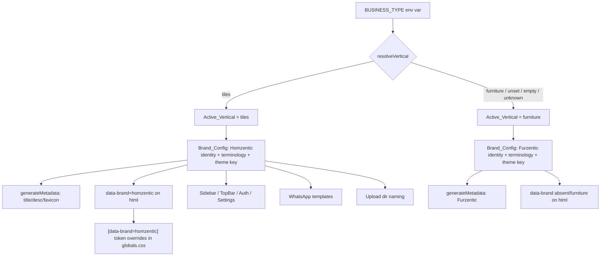
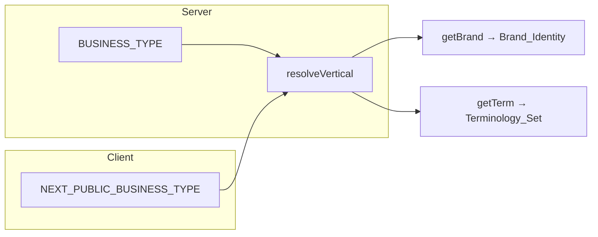
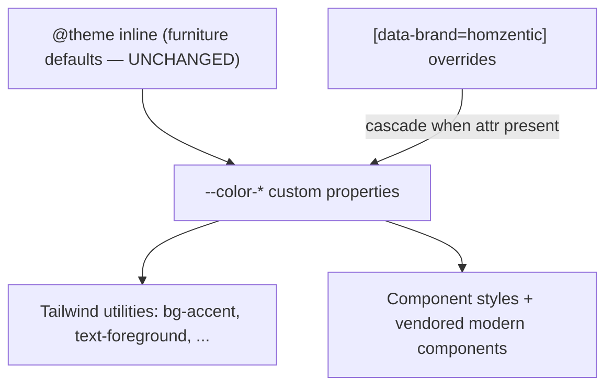

# Design Document

## Overview

This design rebrands the **tiles** vertical of the shared CRM into **Homzentic** while keeping the **furniture** vertical ("Furzentic") byte-for-byte unchanged. The codebase is a single Next.js 16 (App Router) + Prisma + PostgreSQL application that already runs against two isolated databases selected by `BUSINESS_TYPE` (`furniture` default, `tiles`), wired in `lib/db.ts`, `prisma/seed.ts`, the `*:tiles` npm scripts, and `.env.tiles`.

The core architectural move is to replace scattered, hardcoded brand strings and furniture-specific logic with a **single vertical-aware source of truth** (`lib/brand.ts`) and a **runtime-scoped theme** driven by a `data-brand` attribute on the root `<html>` element. Everything Homzentic — name, metadata, favicon, logo, contacts, color palette, terminology, WhatsApp copy, upload paths, and tiles product/quotation behavior — derives from the active vertical. When the vertical is `furniture`, every code path resolves to the exact pre-rebrand values.

The design is deliberately **additive and isolation-first**:

- New Prisma fields are **nullable/optional** so existing furniture rows stay valid (`Requirement 6.2`, `13.3`).
- The Homzentic palette is a set of **CSS variable overrides scoped to `[data-brand="homzentic"]`**; the furniture token block in `app/globals.css` is never edited (`Requirement 4.5`, `13.5`).
- Vertical branches are gated on the resolved `Active_Vertical`, defaulting to `furniture` on any unset/empty/unrecognized value (`Requirement 1.4`).

The work breaks into three layers:

1. **Brand/identity layer** — `lib/brand.ts`, metadata, favicon, logo/contact rendering, terminology, WhatsApp templates, upload-dir naming, settings.
2. **Theme layer** — `data-brand` attribute + scoped Homzentic design tokens in `app/globals.css`, plus the vendored modern component library that consumes those tokens.
3. **Domain layer** — tiles & sanitary product attributes, category seed, and area-based quotation/invoice calculation.

### Research Notes

Findings that shaped the design, grounded in the current code:

- **Metadata is a static export** in `app/layout.js` (`export const metadata = {...}`). To make it vertical-aware without breaking the furniture output, this is converted to a `generateMetadata()` function that reads `Brand_Config`. Next.js App Router supports either a static `metadata` object or a `generateMetadata` function — not both in the same file.
- **Design tokens use Tailwind v4 `@theme inline`** in `app/globals.css`. Utilities compile to `var(--color-*)` references, so redefining those same custom properties under a `[data-brand="homzentic"]` selector cascades to every component at runtime with **no Tailwind config change** and **no edit to the furniture token values**. This is the key enabler for scoped theming.
- **The app is explicitly light-only**: `@custom-variant dark (&:where(.dark, .dark *))` disables Tailwind's automatic `prefers-color-scheme` dark mode. The Homzentic palette must stay light-only (`Requirement 4.7`).
- **Quotation math lives in `computeTotals()`** in `app/(dashboard)/quotations/page.js`: each line `amount = quantity * rate`, summed to `subtotal`, then discount → installation → freight → loading → GST. Area-based logic must slot in at the per-line stage and leave the downstream tax/discount pipeline untouched (`Requirement 8.6`).
- **`Product.unitOfMeasure` already exists** (`String @default("PCS")`), so SQFT/BOX support is a validation/option change plus new attribute columns, not a structural migration.
- **WhatsApp templates hardcode "Kosmic Furniture"**, phone numbers, and address across `lib/whatsapp/inquiry-message.ts` and `appointment-bot.ts`. These become `Brand_Config`-driven.
- **Brand literals** exist in `components/Sidebar.js`, `components/TopBar.js`, the login screen, `payroll/page.js`, and `walkins/page.js`. The in-app chrome (sidebar, top bar, auth) is in scope; print artifacts are noted but treated per the requirement's named surfaces.
- **`getUploadsRoot()` in `lib/r2.ts`** defaults to `../furniture-crm-uploads`; this becomes vertical-aware.
- **Styling stack** is `@base-ui/react` primitives + Tailwind v4 + `cn()` (`lib/utils.ts`, backed by `clsx` + `tailwind-merge`), with `class-variance-authority` for variants and `tw-animate-css` already present. No JS animation runtime is currently installed.

## Architecture

### Vertical resolution flow



### Server vs client brand access

`BUSINESS_TYPE` is server-only. The browser reads `NEXT_PUBLIC_BUSINESS_TYPE` (already present in `.env`/`.env.tiles`). `lib/brand.ts` exposes one resolver that works in both contexts by reading whichever variable is available, so server components, client components, server actions, and the seed/CLI all get a consistent answer.



### Theme scoping model

The root layout sets `data-brand` on `<html>`. The furniture token block in `@theme inline` is the default and is never modified. A new `[data-brand="homzentic"] { ... }` block redefines the same `--color-*` custom properties. Because every Tailwind utility and component style already references those variables, the override propagates everywhere — including vendored modern components — without per-component changes.



## Components and Interfaces

### 1. `lib/brand.ts` — Brand_Config (new)

Single source of truth for vertical identity, terminology, and theme key.

```ts
export type Vertical = 'furniture' | 'tiles'
export type ThemeKey = 'furniture' | 'homzentic'

export interface BrandIdentity {
  vertical: Vertical
  name: string            // "Furzentic" | "Homzentic"
  shortName: string
  title: string           // document <title>
  description: string     // meta description
  tagline: string
  logo: string            // /public asset path
  favicon: string         // favicon path
  themeKey: ThemeKey      // 'furniture' | 'homzentic'
  brandAttribute: ThemeKey | null  // value for data-brand; null when furniture-absent
  support: {
    phone: string
    altPhone?: string
    email: string
    website: string
    address: string
  }
}

/** Resolve vertical from env; furniture on unset/empty/unknown. */
export function resolveVertical(raw?: string | null): Vertical

/** Brand identity for the active (or explicitly passed) vertical. */
export function getBrand(vertical?: Vertical): BrandIdentity

/** Active vertical from BUSINESS_TYPE (server) or NEXT_PUBLIC_BUSINESS_TYPE (client). */
export function getActiveVertical(): Vertical
```

- `resolveVertical` lowercases/ trims input and returns `'tiles'` only on exact `tiles`; everything else → `'furniture'` (`Requirement 1.4`, `13.2`).
- `getActiveVertical` reads `process.env.BUSINESS_TYPE ?? process.env.NEXT_PUBLIC_BUSINESS_TYPE`.
- Furniture identity values are exactly the current strings (title `"Furzentic — Smart Store Manager"`, etc.) so furniture is unchanged (`Requirement 2.2`, `13.1`).
- This module is the only place brand literals live (`Requirement 1.5`, `3.4`, `10.4`).

### 2. `lib/terminology.ts` — Terminology_Set (new, or co-located in `lib/brand.ts`)

```ts
export type TermKey =
  | 'showroom' | 'designConsultation' | 'catalog' | 'product' | 'products'
  // ...shared concept keys

const SHARED: Record<TermKey, string>          // default labels
const OVERRIDES: Record<Vertical, Partial<Record<TermKey, string>>>

/** Resolve a label: vertical override → shared default. */
export function getTerm(key: TermKey, vertical?: Vertical): string
```

- `getTerm` returns the vertical-specific override when present, otherwise the shared default (`Requirement 9.1`, `9.4`).
- Furniture overrides are empty/identical to today's labels so furniture copy is unchanged (`Requirement 9.3`).

### 3. `app/layout.js` — metadata + `data-brand` (modified)

- Replace the static `metadata` export with `export function generateMetadata()` returning title/description/icons from `getBrand()` (`Requirement 2.1–2.5`).
- Set `<html lang="en" data-brand={brand.brandAttribute ?? undefined}>` (`Requirement 4.1`, `4.2`, `13.4`). When furniture, `brandAttribute` is `null` so the attribute is omitted.
- No change to the provider tree or font wiring.

### 4. `app/globals.css` — Homzentic palette overrides (modified, additive)

- Leave the entire `@theme inline` furniture block untouched (`Requirement 13.5`).
- Append a scoped override block:

```css
[data-brand="homzentic"] {
  --color-background: /* ... */;
  --color-foreground: /* ... */;
  --color-primary: /* ... */;
  --color-accent: /* ... */;
  /* every --color-* token the furniture palette defines */
}
```

- The override must define **every** `--color-*` token the furniture palette defines so no token is undefined under `homzentic` (`Requirement 4.6`). All values are light-only (`Requirement 4.7`) and chosen to meet WCAG AA contrast (`Requirement 5.1`, `5.2`).
- Because only variable values change (not layout/spacing/touch utilities), responsive behavior and touch targets are preserved (`Requirement 5.3`, `5.4`).

### 5. Brand chrome rendering (modified)

`components/Sidebar.js`, `components/TopBar.js`, and the login screen replace hardcoded `"Furzentic"` and logo references with `getBrand()` values (`Requirement 3.1`, `3.2`, `3.4`). A small server helper or `NEXT_PUBLIC_BUSINESS_TYPE` read supplies the brand to client components. Support-contact displays read `brand.support` (`Requirement 3.3`).

### 6. Tiles product attributes (modified)

- New nullable Prisma fields on `Product` (see Data Models).
- Product form shows the `Tiles_Attribute_Set` inputs and `SQFT`/`BOX` unit options **only when** `Active_Vertical === 'tiles'`; furniture shows existing fields with no tiles inputs (`Requirement 6.1`, `6.7`).
- Finish select: glossy/matte/rustic; application area select: floor/wall/bathroom (`Requirement 6.5`, `6.6`).
- Validation via `zod` (existing in `lib/validations`).

### 7. Quotation/Invoice area calculation (modified)

`computeLineAmount()` helper added near `computeTotals()` in `app/(dashboard)/quotations/page.js` (and the matching invoice path):

```ts
function computeLineAmount(item, product) {
  // furniture & PCS: quantity * rate (unchanged)
  // SQFT: amount = area * perSqftPrice; if coverage present → boxes = ceil(area / coverage)
  // BOX with coverage: derive boxes from area
  // SQFT/BOX without coverage: use entered quantity directly, no box conversion
}
```

- Returns `{ amount, boxes?, area? }`; the line renders both area and box count when a conversion happens (`Requirement 8.2`, `8.3`). Downstream discount/tax/currency pipeline is unchanged (`Requirement 8.6`). Furniture path is the existing `quantity * rate` (`Requirement 8.5`).

### 8. WhatsApp templates (modified)

`lib/whatsapp/inquiry-message.ts` and `lib/whatsapp/appointment-bot.ts` source brand name, contacts, address, website, and product category descriptions from `Brand_Config` and the tiles terminology/category set (`Requirement 10.1`, `10.2`, `10.4`). Furniture output is preserved by furniture `Brand_Config` values (`Requirement 10.3`).

### 9. Upload directory naming (modified)

`getUploadsRoot()` in `lib/r2.ts`:

```ts
export function getUploadsRoot(): string {
  if (process.env.UPLOAD_DIR) return process.env.UPLOAD_DIR.replace(/[\\/]+$/, '')
  const vertical = getActiveVertical()
  const base = vertical === 'tiles' ? '../tiles-sanitary-crm-uploads' : '../furniture-crm-uploads'
  return `${process.cwd()}/${base}`.replace(/[\\/]+$/, '')
}
```

`UPLOAD_DIR` always wins (`Requirement 11.1`); otherwise vertical-named default (`Requirement 11.2`, `11.3`).

### 10. Brand & appearance settings (modified)

The Settings_Module (`app/(dashboard)/settings/page.js` + `app/actions/settings`) displays and edits `StoreSettings` (name, phone, email, address) and logo upload for the active vertical (`Requirement 12.1–12.3`, `12.5`). Validation rejects malformed email/empty name with a field-identifying message (`Requirement 12.4`). Writes go through the active vertical's database via the existing Prisma client, so tiles edits never touch furniture data (`Requirement 12.6`).

### 11. Modern component library adoption (new, vendored)

- Components are **copied into `components/ui/*`** as `Vendored_Component`s (shadcn-style), not added as opaque runtime packages (`Requirement 15.1`).
- Each must use `@base-ui/react` primitives, Tailwind v4, and `cn()`, and style exclusively via `--color-*` tokens — no hardcoded colors (`Requirement 15.2`, `15.3`, `15.4`). Token use means they automatically render Homzentic under `[data-brand="homzentic"]` and Furzentic otherwise (`Requirement 15.5`, `15.6`, `15.7`).
- If a component needs JS animation, a **single shared** runtime (`motion`) is added at one version (`Requirement 15.8`). Incompatible components are rejected until adapted (`Requirement 15.9`).
- Performance handling per Requirement 16: dynamic `import()` code-splitting for heavy/animated components (`16.3`), Server Components where no interactivity is needed (`16.4`), prefer CSS animation (`tw-animate-css`) over JS (`16.5`), load the runtime only where used (`16.6`), honor `prefers-reduced-motion` (`16.7`), and avoid per-row animation on large tables (`16.8`).

## Data Models

### Prisma `Product` — additive tiles attributes

All new fields are nullable/optional; furniture rows remain valid and readable (`Requirement 6.2`, `13.3`). `unitOfMeasure` already exists with `@default("PCS")` (`Requirement 6.4`).

```prisma
model Product {
  // ... existing fields unchanged ...
  unitOfMeasure String @default("PCS") // now also accepts "SQFT" | "BOX" for tiles (6.3)

  // ── Tiles & Sanitary attributes (nullable, additive) ──
  tileSize        String?  // e.g. "600x600"
  finish          String?  // glossy | matte | rustic
  coveragePerBox  Float?   // sq.ft covered by one box
  tilesPerBox     Int?     // pieces per box
  surfaceType     String?  // surface descriptor
  applicationArea String?  // floor | wall | bathroom
}
```

- Unit options are enforced in application validation (`zod`), not the DB type, to keep furniture rows valid and the migration additive.
- `coveragePerBox` is the driver for area→box conversion in the Quotation_Engine.

### `QuotationItem` / `InvoiceItem` — area display (additive, optional)

To display both area and box count (`Requirement 8.3`) without breaking existing rows, optional fields are added:

```prisma
model QuotationItem {
  // ... existing ...
  areaInput Float? // entered area (sq.ft) for tiles lines
  boxCount  Int?   // computed boxes when a conversion occurred
}
```

If persisting is undesirable, the same values can be derived at render time from the product's `coveragePerBox`; the design keeps them optional so furniture lines are unaffected.

### `StoreSettings`

No structural change required. The existing record (name, phone, email, address, logo, currency, GST) backs the Settings_Module per vertical; isolation is provided by the separate database (`Requirement 12.6`).

### Vertical / Brand value objects (in-memory, not persisted)

`BrandIdentity` and the `Terminology_Set` are plain TypeScript values resolved at runtime from the env-selected vertical; they are not stored in the database.

## Correctness Properties

*A property is a characteristic or behavior that should hold true across all valid executions of a system — essentially, a formal statement about what the system should do. Properties serve as the bridge between human-readable specifications and machine-verifiable correctness guarantees.*

### Property 1: Vertical resolution defaults to furniture

*For any* string value of `BUSINESS_TYPE` (including unset, empty, mixed-case, or unrecognized), `resolveVertical` returns `tiles` if and only if the trimmed lowercased value equals `"tiles"`, and returns `furniture` in every other case.

**Validates: Requirements 1.4, 13.2**

### Property 2: Brand identity matches the resolved vertical

*For any* vertical, `getBrand` returns an identity whose `name` is `"Homzentic"` when the vertical is `tiles` and `"Furzentic"` when the vertical is `furniture`, and whose `brandAttribute` is `homzentic` for tiles and `null`/`furniture` for furniture.

**Validates: Requirements 1.2, 1.3, 2.1, 2.2, 4.1, 4.2, 13.4**

### Property 3: Brand identity is complete

*For any* vertical, the `BrandIdentity` returned by `getBrand` has non-empty values for name, title, description, logo, favicon, tagline, themeKey, and every `support` contact field.

**Validates: Requirements 1.1**

### Property 4: Terminology resolves override-then-default

*For any* terminology key and vertical, `getTerm` returns the vertical-specific override when one is defined and the shared default otherwise, and never returns undefined for a known key.

**Validates: Requirements 9.1, 9.4**

### Property 5: Homzentic palette defines every furniture token

*For any* `--color-*` design token defined by the furniture palette, the `[data-brand="homzentic"]` override block defines a value for that same token.

**Validates: Requirements 4.6**

### Property 6: Homzentic palette meets contrast minimums

*For any* foreground/background token pair used together in the Homzentic palette, the contrast ratio is at least 4.5:1 for normal text and at least 3:1 for large text, control boundaries, and focus indicators.

**Validates: Requirements 5.1, 5.2**

### Property 7: SQFT line amount is area times unit price

*For any* line item whose product unit is `SQFT`, the computed line amount equals the entered area multiplied by the per-SQFT price (before discount/tax).

**Validates: Requirements 8.1**

### Property 8: Area-to-box conversion rounds up

*For any* tiles line entered as an area where the product defines a positive `coveragePerBox`, the computed box count equals `ceil(area / coveragePerBox)` and both the entered area and the box count are present on the line.

**Validates: Requirements 8.2, 8.3**

### Property 9: Missing coverage skips box conversion

*For any* product whose unit is `SQFT` or `BOX` but which has no `coveragePerBox`, the engine computes using the entered quantity directly and produces no box conversion.

**Validates: Requirements 8.4**

### Property 10: Furniture line math is unchanged

*For any* line item in the furniture vertical (or any `PCS` product), the computed line amount equals `quantity * rate`, identical to the pre-rebrand behavior.

**Validates: Requirements 8.5, 13.1**

### Property 11: Tax/discount pipeline is unit-agnostic

*For any* set of line items with given discount, installation, freight, loading, and GST inputs, the totals pipeline produces the same subtotal-to-grand-total result whether a line's amount came from per-unit or area-based computation.

**Validates: Requirements 8.6**

### Property 12: Upload root resolution

*For any* environment, `getUploadsRoot` returns the configured `UPLOAD_DIR` (trailing separators stripped) when it is set; otherwise it returns the tiles-named default when the active vertical is `tiles` and the furniture-named default when it is `furniture`.

**Validates: Requirements 11.1, 11.2, 11.3**

### Property 13: Tiles attributes are optional in the data model

*For any* product record with all `Tiles_Attribute_Set` fields null, the record validates and is readable, and defaults `unitOfMeasure` to `PCS` when unspecified.

**Validates: Requirements 6.2, 6.4, 13.3**

### Property 14: Store settings validation rejects invalid contacts

*For any* settings submission with a malformed email or an empty store name, the update is rejected with a validation message identifying the offending field, and valid submissions persist.

**Validates: Requirements 12.2, 12.4**

## Error Handling

- **Vertical resolution never throws.** `resolveVertical` treats unset/empty/unknown as `furniture`, guaranteeing a valid brand in all environments (`Requirement 1.4`).
- **Metadata/theme degradation.** If `NEXT_PUBLIC_BUSINESS_TYPE` is missing on the client, the resolver falls back to `furniture`, so the worst case is the default brand — never a crash or undefined token (the override block is only applied when the attribute is explicitly `homzentic`).
- **Quotation calculation guards.** Area and price inputs are coerced with the existing `Math.max(0, Number(x) || 0)` pattern; division for box conversion is guarded against zero/missing `coveragePerBox` (falls through to direct quantity per `Requirement 8.4`). Box counts use `Math.ceil` and are clamped to ≥ 0.
- **Settings validation.** `zod` schemas validate email format and non-empty name server-side in the action; failures return a structured field error rather than persisting (`Requirement 12.4`). Logo upload errors surface a user-facing message and leave the prior logo intact.
- **WhatsApp templates.** Existing try/catch "never break the main flow" behavior is preserved; brand lookups are pure and cannot fail, so swapping literals for `Brand_Config` adds no new failure modes.
- **Component adoption guardrails.** A vendored component that cannot consume tokens or is incompatible with the styling system is not integrated (`Requirement 15.9`); this is enforced in review, not at runtime.
- **Migration safety.** New Prisma columns are nullable with no backfill, so applying the migration to the furniture database cannot invalidate existing rows (`Requirement 13.3`).

## Testing Strategy

### Dual approach

- **Property-based tests** validate the pure logic that varies with input: vertical resolution, brand/terminology resolution, area-based quotation math, upload-root resolution, and settings validation (Properties 1–14 where applicable).
- **Unit/example tests** cover concrete scenarios and edge cases: furniture metadata equals the exact pre-rebrand strings, the `data-brand` attribute is absent for furniture and `homzentic` for tiles, the product form hides tiles inputs under furniture, and box-count display formatting.
- **Snapshot/visual tests** cover theming and component rendering (palette application under `[data-brand="homzentic"]`, vendored components inheriting tokens) — property-based testing is not used for CSS/visual output.
- **Static/CSS audit tests** assert token completeness (Property 5) by parsing `globals.css`, and a contrast check (Property 6) over the Homzentic token pairs.

### Property-based testing setup

- Use a property-based testing library for the target language (TypeScript): **fast-check** with the existing test runner. Do not hand-roll generators/shrinking.
- Each property test runs a **minimum of 100 iterations**.
- Each property test is tagged with a comment referencing its design property, format:
  `// Feature: homzentic-tiles-rebrand, Property {number}: {property_text}`
- Properties most valuable here: **Property 7–11** (quotation math — round-trip/invariant/metamorphic style, including `ceil` rounding and unit-agnostic totals), **Property 1** (resolution total function), **Property 4** (override-then-default), and **Property 12** (upload-root precedence).

### What is NOT property-tested

- Favicon serving, logo asset rendering, and palette visuals → snapshot/manual verification.
- WhatsApp send side effects → existing mock-based behavior; only the brand-value substitution is asserted via example tests.
- Responsive/touch-target preservation (`Requirement 5.3`, `5.4`) → manual + viewport snapshot checks.

### Rollout verification (Requirement 14, 16.9)

A documented checklist accompanies the change and is exercised before release:

1. Boot with `BUSINESS_TYPE=furniture` (and unset) → confirm sidebar, top bar, auth screen, product form, quotation/invoice, and settings are identical to pre-rebrand (`Requirement 14.2`, `14.3`).
2. Boot with `BUSINESS_TYPE=tiles` → confirm Homzentic name, palette, tiles terminology, tiles attributes/units, and area calculation across the same screens (`Requirement 14.1`).
3. Confirm switching `BUSINESS_TYPE` changes only the intended vertical's presentation (`Requirement 14.4`).
4. **Performance check**: run `Bundle_Analysis` and compare initial-route JS payload, LCP, and INP on a mid-range device profile against the pre-change baseline; confirm no verified route exceeds the `Performance_Budget` and that animation/component additions stay within the added-bundle limit (`Requirement 16.1`, `16.2`, `16.9`).

### Performance budget (Requirement 16.1)

The rebrand commits to explicit limits, verified in step 4 above:

- **Initial route JS payload**: no increase beyond the documented baseline + a small fixed allowance for vendored components.
- **LCP target** and **INP target** measured on the `Mid_Range_Device` profile.
- **Max added client bundle** attributable to animation + component libraries (single shared `motion` runtime, loaded only where used).
