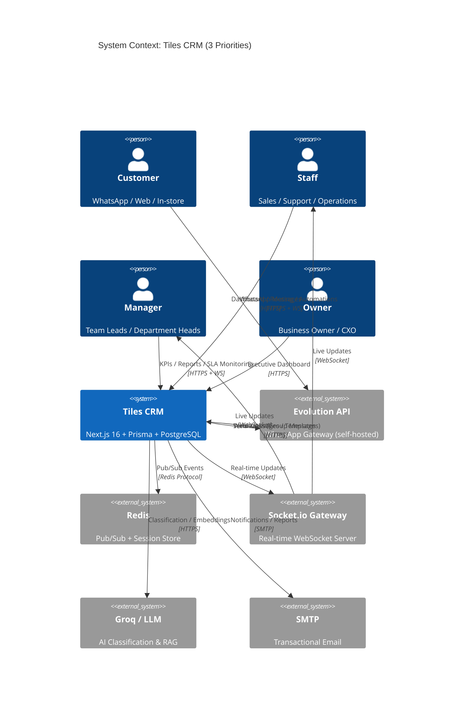
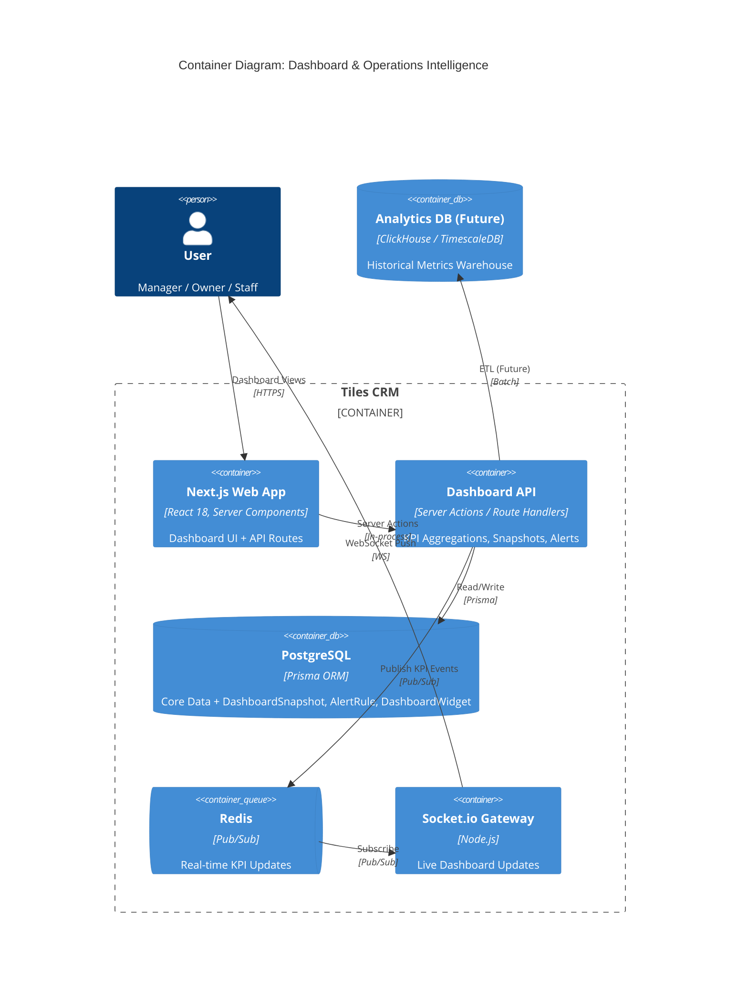
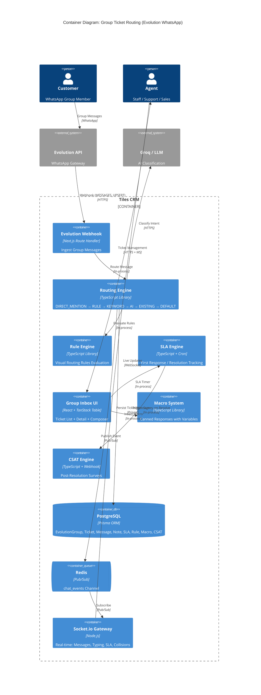
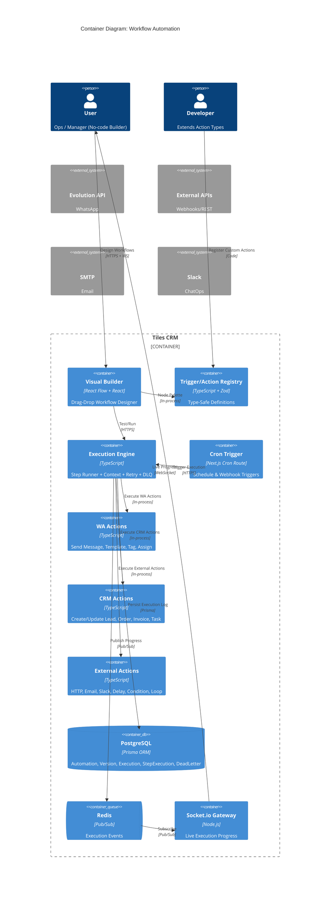
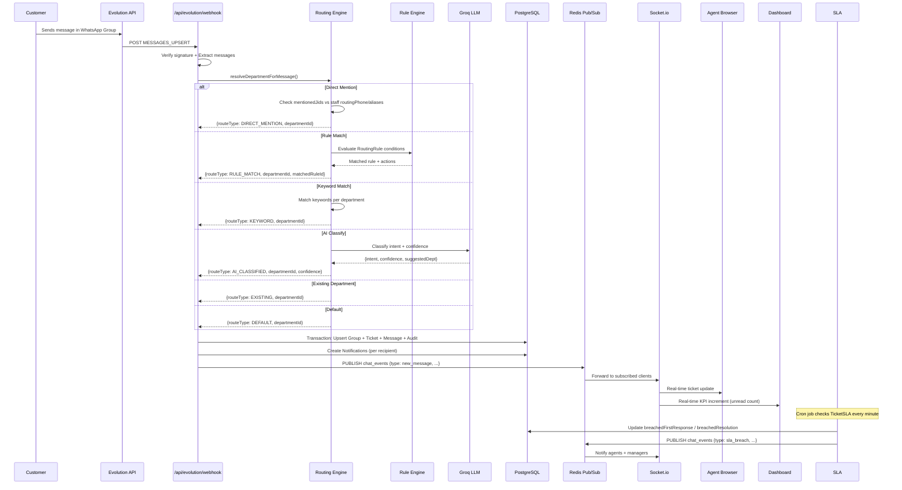

# Tiles CRM — Implementation Plan for 3 Business Priorities

**Date**: 2026-08-26  
**Based on**: Deep audit of commit `54da2e6` (latest)  
**Architecture**: Next.js 16 + Turbopack, Prisma 7.9.1, PostgreSQL, Evolution API v2.3.7, Socket.io WebSocket

---

## Executive Summary

This plan maps the current project capabilities against three strategic priorities:
1. **Dashboard & Operations Intelligence** — Unified executive & staff dashboard with real-time KPIs
2. **Group Ticket Routing (Evolution WhatsApp)** — Enterprise-grade multi-department group inbox
3. **Workflow Automation** — Visual no-code automation builder for WhatsApp & CRM actions

The codebase already has ~80% of the data models and ~60% of the backend logic. This plan identifies gaps, defines architecture, and provides a phased implementation roadmap.

---

## 1. Current Capability Baseline (from Audit)

| Module | Models | Backend | UI | Status |
|--------|--------|---------|-----|--------|
| **WhatsApp Evolution** | 18 models | Webhook, routing, tickets, audit | `routing-crm` page | Production-ready |
| **Dealer Management** | 10 models | Server actions | `/dealers` | Production-ready |
| **Product/Stone Inventory** | 12 models | Server actions | `/inventory`, `/godowns` | Production-ready |
| **Dashboard/Analytics** | Aggregated | `dashboard.ts` actions | Root `/` page | Basic KPIs only |
| **Order Fulfillment** | 8 models | Server actions | `/orders`, `/quotations`, `/billing` | Production-ready |
| **Staff/Permissions** | 7 models | Auth + payroll | `/staff`, `/staff-portal`, `/payroll` | Production-ready |
| **Automation (WA)** | 4 models | Cron engine + API | `/automations` | Visual builder exists |
| **AI RAG Agent** | 3 models | Groq + JSONB embeddings | Settings embedded | Production-ready |
| **Notifications/Realtime** | 1 model | Socket.io gateway + Redis | Global bell + hooks | Production-ready |
| **Social (FB/IG)** | 5 models | Webhook + API | `/facebook-inbox`, `/instagram-inbox` | Basic inbox |

---

## 2. Priority 1: Dashboard & Operations Intelligence

### 2.1 Vision
A single "Command Center" that gives every role (Owner, Manager, Sales, Operations) their relevant KPIs, alerts, and actions in real-time — replacing the current basic root page.

### 2.2 Current Gaps
| Area | Current | Target |
|------|---------|--------|
| **Executive KPIs** | Basic counts only | Revenue trend, pipeline velocity, conversion funnels, cash position |
| **Operational Views** | None | Stock aging, order fulfillment SLA, dealer performance, production WIP |
| **Real-time** | Socket.io connected | Live KPI cards, anomaly alerts, threshold breaches |
| **Role Personalization** | None | Configurable widgets per role/department |
| **Drill-down** | Nav to list pages | In-dashboard drill-through with preserved context |
| **Export/Schedule** | None | PDF/CSV export, scheduled email snapshots |

### 2.3 Target Architecture

```
┌─────────────────────────────────────────────────────────────┐
│                    Dashboard Layout (Server Component)      │
├─────────────────────────────────────────────────────────────┤
│  Header: Org Switcher | Date Range | Export | Refresh       │
├──────────────┬──────────────┬──────────────┬────────────────┤
│  KPI Row     │  KPI Row     │  KPI Row     │  KPI Row       │
│  (Revenue)   │  (Pipeline)  │  (Cash)      │  (Alerts)      │
├──────────────┼──────────────┼──────────────┼────────────────┤
│              │              │              │                │
│  Chart:      │  Chart:      │  Table:      │  Feed:         │
│  Revenue     │  Funnel      │  Top Items   │  Activity      │
│  Trend       │  (Lead→Order)│  (Dealers/   │  (Real-time)   │
│  (Recharts)  │  (Recharts)  │   Products)  │                │
│              │              │              │                │
├──────────────┴──────────────┴──────────────┴────────────────┤
│  Tabbed Section: Overview | Sales | Inventory | Operations  │
│  Each tab = Server Component with Suspense boundaries       │
└─────────────────────────────────────────────────────────────┘
```

### 2.4 Data Layer — New Prisma Models

```prisma
// Dashboard widget configuration per user/role
model DashboardWidget {
  id          String   @id @default(cuid())
  userId      Int      // nullable for role defaults
  role        UserRole? // ADMIN | MANAGER | STAFF
  widgetKey   String   // e.g. "revenue_trend", "stock_aging"
  position    Int      // grid position
  config      Json     // { timeRange: "30d", filters: {...} }
  isVisible   Boolean  @default(true)
  createdAt   DateTime @default(now())
  updatedAt   DateTime @updatedAt

  @@unique([userId, widgetKey])
  @@index([role, widgetKey])
}

// Materialized view for expensive aggregations (refreshed via cron)
model DashboardSnapshot {
  id            String   @id @default(cuid())
  snapshotType  String   // "daily", "hourly", "realtime"
  periodStart   DateTime
  periodEnd     DateTime
  metrics       Json     // { revenue: 12345, orders: 56, ... }
  createdAt     DateTime @default(now())

  @@index([snapshotType, periodStart])
}

// Alert rules for threshold-based notifications
model AlertRule {
  id           String   @id @default(cuid())
  name         String
  metric       String   // "stock_days", "overdue_invoices", "conversion_rate"
  operator     String   // "lt", "gt", "eq", "change_pct"
  threshold    Float
  severity     String   // "info" | "warning" | "critical"
  channels     String[] // ["in_app", "whatsapp", "email"]
  recipients   Int[]    // user IDs or role names
  isActive     Boolean  @default(true)
  cooldownMins Int      @default(60)
  lastTriggered DateTime?
  createdAt    DateTime @default(now())
  updatedAt    DateTime @updatedAt

  @@index([metric, isActive])
}
```

### 2.5 Server Actions (`app/actions/dashboard.ts`)

```typescript
// Core KPI aggregates - single round-trip per section
export async function getExecutiveKPIs(timeRange: '7d' | '30d' | '90d' | 'ytd') {
  const [revenue, pipeline, cash, conversion, alerts] = await Promise.all([
    getRevenueTrend(timeRange),
    getPipelineVelocity(timeRange),
    getCashPosition(),
    getConversionFunnel(timeRange),
    getActiveAlerts(),
  ])
  return { revenue, pipeline, cash, conversion, alerts }
}

// Real-time subscription via Socket.io
export function subscribeToKPIUpdates(userId: number, widgets: string[]) {
  // Emits 'kpi_update' events on Redis chat_events channel
}
```

### 2.6 UI Components (Recharts + Tailwind)

| Component | Library | Props |
|-----------|---------|-------|
| `KPICard` | Custom | `value`, `trend`, `sparkline`, `threshold`, `onClick` |
| `RevenueTrendChart` | Recharts | `data`, `granularity`, `comparisonPeriod` |
| `PipelineFunnel` | Recharts | `stages`, `conversionRates`, `hoverDetail` |
| `StockAgingTable` | TanStack Table | `columns`, `sortable`, `filterable`, `exportCSV` |
| `ActivityFeed` | Custom | `events`, `realtime`, `groupByDate` |
| `WidgetGrid` | React Grid Layout | `draggable`, `resizable`, `persistLayout` |

### 2.7 Implementation Phases

| Phase | Scope | Est. Effort |
|-------|-------|-------------|
| **1A** | Schema migration + snapshot cron job | 2 days |
| **1B** | Executive KPI server actions + API | 3 days |
| **1C** | Core UI: KPI cards, revenue chart, funnel | 4 days |
| **1D** | Role-based widget config + persistence | 2 days |
| **1E** | Real-time subscriptions + alert rules engine | 3 days |
| **1F** | Export (PDF/CSV) + scheduled email snapshots | 2 days |
| **Total** | **~16 days** | |

---

## 3. Priority 2: Group Ticket Routing (Evolution WhatsApp)

### 3.1 Vision
Transform the existing `routing-crm` page into an enterprise-grade **Group Inbox** that rivals Missive/Front/Intercom — with department routing, SLA tracking, agent collaboration, and full audit trail.

### 3.2 Current State (Strong Foundation)

**Already Working:**
- `EvolutionGroup`, `EvolutionGroupMessage`, `EvolutionGroupTicket`, `EvolutionRoutingAudit` models
- Webhook ingestion with idempotency + group locking
- Department routing: `DIRECT_MENTION` > `KEYWORD` > `AI_CLASSIFIED` > `EXISTING` > `DEFAULT`
- Mention-priority bubbling (`mentionPriority` flag)
- Ticket claim/release by assigned agents
- Real-time updates via Socket.io (`chat_events` channel)

### 3.3 Gaps vs. Production Reference (Missive/Front/Zendesk)

| Capability | Current | Target | Reference |
|------------|---------|--------|-----------|
| **Shared Drafts** | ❌ | Collaborative reply compose | Missive |
| **Internal Notes** | ❌ | Private thread on ticket | Front |
| **SLA Timer** | ❌ | First response / resolution SLA per dept | Zendesk |
| **CSAT Survey** | ❌ | Post-resolution 1-click survey | Intercom |
| **Macro/Templates** | ❌ | One-click canned responses with variables | All |
| **Collision Detection** | Basic | "Agent X is typing..." indicator | Missive |
| **Conversation Merging** | ❌ | Merge related group threads | Front |
| **Assignment Rules UI** | Code-only | Visual rule builder (if/then) | Zendesk |
| **Reporting** | None | Volume, SLA breach, CSAT, agent perf | All |

### 3.4 New Prisma Models

```prisma
// Internal notes on tickets (agent-only)
model EvolutionGroupNote {
  id        String   @id @default(cuid())
  ticketId  String
  ticket    EvolutionGroupTicket @relation(fields: [ticketId], references: [id], onDelete: Cascade)
  userId    Int
  user      User     @relation(fields: [userId], references: [id])
  content   String   @db.Text
  isInternal Boolean  @default(true)
  createdAt DateTime @default(now())
  updatedAt DateTime @updatedAt

  @@index([ticketId, createdAt])
}

// SLA configuration per department
model DepartmentSLA {
  id                 String   @id @default(cuid())
  departmentId       Int      @unique
  department         RoutingDepartment @relation(fields: [departmentId], references: [id])
  firstResponseMins  Int      @default(15)
  resolutionMins     Int      @default(240) // 4 hours
  businessHoursOnly  Boolean  @default(true)
  timezone           String   @default("Asia/Kolkata")
  escalationUserId   Int?     // escalate after breach
  createdAt          DateTime @default(now())
  updatedAt          DateTime @updatedAt
}

// SLA tracking per ticket
model TicketSLA {
  id                  String   @id @default(cuid())
  ticketId            String   @unique
  ticket              EvolutionGroupTicket @relation(fields: [ticketId], references: [id], onDelete: Cascade)
  firstResponseDue    DateTime?
  firstRespondedAt    DateTime?
  resolutionDue       DateTime?
  resolvedAt          DateTime?
  breachedFirstResponse Boolean @default(false)
  breachedResolution  Boolean  @default(false)
  escalatedAt         DateTime?
  createdAt           DateTime @default(now())
  updatedAt           DateTime @updatedAt
}

// Canned responses (macros) with variables
model Macro {
  id          String   @id @default(cuid())
  name        String
  content     String   @db.Text
  variables   String[] // e.g. ["customerName", "orderId"]
  departmentId Int?
  department   RoutingDepartment? @relation(fields: [departmentId], references: [id])
  isGlobal    Boolean  @default(false)
  createdById Int
  createdBy   User     @relation(fields: [createdById], references: [id])
  createdAt   DateTime @default(now())
  updatedAt   DateTime @updatedAt

  @@index([departmentId])
}

// CSAT survey responses
model CSATResponse {
  id          String   @id @default(cuid())
  ticketId    String   @unique
  ticket      EvolutionGroupTicket @relation(fields: [ticketId], references: [id], onDelete: Cascade)
  rating      Int      // 1-5
  comment     String?
  respondentJid String  // customer WhatsApp JID
  createdAt   DateTime @default(now())
}

// Assignment rules (visual builder persistence)
model RoutingRule {
  id            String   @id @default(cuid())
  name          String
  departmentId  Int
  department    RoutingDepartment @relation(fields: [departmentId], references: [id])
  priority      Int      @default(0) // lower = higher priority
  conditions    Json     // { field: "text", operator: "contains", value: "complaint" }
  actions       Json     // { assignTo: "userId", addTag: "urgent", setPriority: "high" }
  isActive      Boolean  @default(true)
  createdAt     DateTime @default(now())
  updatedAt     DateTime @updatedAt

  @@index([departmentId, priority])
}
```

### 3.5 Enhanced Routing Logic (`lib/evolution-routing.ts`)

```typescript
// Extended routing with rule engine + SLA
interface RoutingResult {
  departmentId: number | null
  departmentName: string | null
  routeType: 'DIRECT_MENTION' | 'KEYWORD' | 'RULE_MATCH' | 'AI_CLASSIFIED' | 'EXISTING' | 'DEFAULT'
  routingReason: string
  assignedUserId?: number
  confidence?: number
  intent?: string
  mentionPriority: boolean
  sla?: DepartmentSLA // attached for ticket creation
  matchedRuleId?: string
}

async function resolveDepartmentForMessage(params: {
  groupJid: string
  subject: string
  text: string
  mentionedJids: string[]
  existingDepartmentId: number | null
  senderJid: string
}): Promise<RoutingResult> {
  // 1. DIRECT_MENTION - check if any staff mentioned
  // 2. RULE_MATCH - evaluate RoutingRule conditions (new)
  // 3. KEYWORD - existing keyword matching
  // 4. AI_CLASSIFIED - LLM classification with confidence
  // 5. EXISTING - preserve current department
  // 6. DEFAULT - fallback department
  
  // Attach SLA config for ticket creation
  const sla = await getDepartmentSLA(routingResult.departmentId)
  return { ...routingResult, sla }
}
```

### 3.6 UI: Enhanced `routing-crm/page.jsx`

**Layout:**
```
┌────────────────────────────────────────────────────────────────────┐
│  Sidebar: Departments (with unread badges) | Filters | Tags       │
├────────────────────────────────────────────────────────────────────┤
│  Ticket List (TanStack Table)                                       │
│  ☐  #1234  Sales      [🟢]  John Doe          "Price inquiry..."  │
│  ☐  #1235  Support    [🔴]  Jane Smith  ⏱️  "Delivery delayed"    │
│  ☐  #1236  Logistics  [🟡]  Unassigned       "Stock transfer"      │
├────────────────────────────────────────────────────────────────────┤
│  Ticket Detail (split view)                                         │
│  ┌──────────────────────────┬────────────────────────────────────┐ │
│  │ Messages (virtualized)   │  Side Panel:                       │ │
│  │ ─────────────────────    │  ├─ Internal Notes                 │ │
│  │ 👤 Customer: "Hi..."     │  ├─ Customer Profile (Contact)     │ │
│  │ 🤖 Bot: "Welcome..."     │  ├─ Related Tickets                │ │
│  │ 👤 Agent: "Here's info"  │  ├─ Macros (insert)                │ │
│  │                          │  ├─ SLA Timer ⏱️ 12m 34s          │ │
│  │                          │  └─ Actions: Claim/Release/Resolve │ │
│  └──────────────────────────┴────────────────────────────────────┘ │
│  Composer: [Internal Note] [Macro ▼] [Attach] [Send]               │
└────────────────────────────────────────────────────────────────────┘
```

### 3.7 Real-time Features (Socket.io)

```javascript
// ws-server/index.js extensions
socket.on('ticket:typing', ({ ticketId, userId, isTyping }) => {
  socket.to(`ticket:${ticketId}`).emit('agent:typing', { userId, isTyping })
})

socket.on('ticket:view', ({ ticketId, userId }) => {
  socket.join(`ticket:${ticketId}`)
  // Track active viewers for collision detection
})

// Server-side: SLA breach detection cron (every minute)
cron('* * * * *', async () => {
  const breached = await prisma.ticketSLA.findMany({
    where: { resolutionDue: { lt: new Date() }, breachedResolution: false }
  })
  for (const sla of breached) {
    await escalateTicket(sla.ticketId)
    await notifyManagers({ type: 'sla_breach', ticketId: sla.ticketId })
  }
})
```

### 3.8 Implementation Phases

| Phase | Scope | Est. Effort |
|-------|-------|-------------|
| **2A** | Schema migration: notes, SLA, macros, CSAT, rules | 2 days |
| **2B** | Rule engine + SLA attachment in routing | 3 days |
| **2C** | Internal notes + collision detection (Socket.io) | 3 days |
| **2D** | Macro system + composer integration | 2 days |
| **2E** | CSAT survey flow (post-resolve webhook) | 2 days |
| **2F** | Visual rule builder UI (drag-drop conditions) | 4 days |
| **2G** | Reporting dashboard (volume, SLA, CSAT, agent) | 3 days |
| **2H** | Conversation merge + advanced filters | 2 days |
| **Total** | **~21 days** | |

---

## 4. Priority 3: Workflow Automation

### 4.1 Vision
A **visual no-code automation builder** that lets non-technical staff create workflows like:
- "When WhatsApp message contains 'price' → Create Lead → Assign to Sales → Send template reply"
- "When Order status = DELIVERED → Wait 7 days → Send CSAT survey → Create follow-up task"
- "When Stock < reorderLevel → Create PO → Notify Purchase Manager → Post to WhatsApp group"

### 4.2 Current State

**Already Working:**
- `WaAutomation`, `WaAutomationStep`, `WaAutomationLog`, `WaAutomationPendingExecution` models
- Cron-based execution engine (`/api/automations/cron/route.ts`)
- Tree-based conditional steps with branching
- Execution logging + duplicate functionality
- Visual builder at `/automations/new` (React Flow)

### 4.3 Gaps vs. Production Reference (Zapier/Make/n8n/HubSpot)

| Capability | Current | Target | Reference |
|------------|---------|--------|-----------|
| **Trigger Types** | WA only | WA + CRM events (Lead, Order, Invoice, Stock, Payment) + Webhook + Schedule | All |
| **Action Types** | WA send | WA + CRM (create/update), Email, HTTP webhook, Slack, Delay, Condition, Loop | All |
| **Visual Builder** | Basic React Flow | Full node palette, minimap, undo/redo, validation | n8n |
| **Testing/Debug** | Logs only | Step-by-step replay, mock data, time travel | Zapier |
| **Versioning** | Duplicate only | Version history, rollback, publish/draft | HubSpot |
| **Error Handling** | Basic retry | Dead letter queue, alert on failure, auto-retry policy | n8n |
| **Rate Limiting** | None | Per-action + global quotas, backoff | All |
| **Templates** | None | Pre-built recipes (e.g., "New Lead Welcome") | HubSpot |

### 4.4 Extended Prisma Models

```prisma
// Extended automation with versioning
model Automation {
  id                String   @id @default(cuid())
  userId            String
  name              String
  description       String?
  triggerType       String   // "wa_message" | "crm_event" | "webhook" | "schedule" | "manual"
  triggerConfig     Json     // { event: "lead.created", filters: {...} }
  isActive          Boolean  @default(false)
  status            String   @default("draft") // draft | published | archived
  version           Int      @default(1)
  publishedVersion  Int?     // points to AutomationVersion
  executionCount    Int      @default(0)
  lastExecutedAt    DateTime?
  errorCount        Int      @default(0)
  lastError         String?
  createdAt         DateTime @default(now())
  updatedAt         DateTime @updatedAt

  steps             AutomationStep[]
  versions          AutomationVersion[]
  logs              AutomationLog[]
  pending           AutomationPendingExecution[]

  @@index([userId, status])
  @@index([triggerType, isActive])
}

model AutomationVersion {
  id            String   @id @default(cuid())
  automationId  String
  automation    Automation @relation(fields: [automationId], references: [id], onDelete: Cascade)
  version       Int
  definition    Json     // Full serialized workflow (nodes + edges)
  changelog     String?
  publishedAt   DateTime?
  createdAt     DateTime @default(now())

  @@unique([automationId, version])
}

// Extended step with all action types
model AutomationStep {
  id              String   @id @default(cuid())
  automationId    String
  automation      Automation @relation(fields: [automationId], references: [id], onDelete: Cascade)
  parentStepId    String?
  parentStep      AutomationStep? @relation("StepHierarchy", fields: [parentStepId], references: [id], onDelete: Cascade)
  childSteps      AutomationStep[] @relation("StepHierarchy")
  branch          String?  // for conditional branches
  stepType        String   // "trigger" | "action" | "condition" | "delay" | "loop" | "webhook"
  stepConfig      Json     // { action: "create_lead", fields: {...} }
  position        Int
  retryPolicy     Json?    // { maxRetries: 3, backoffMs: 5000 }
  timeoutMs       Int?     // step timeout
  continueOnError Boolean  @default(false)
  createdAt       DateTime @default(now())
  updatedAt       DateTime @updatedAt

  @@index([automationId, position])
}

// Execution with full context for replay
model AutomationExecution {
  id              String   @id @default(cuid())
  automationId    String
  version         Int      // which version executed
  triggerPayload  Json     // input that started the run
  status          String   // "running" | "completed" | "failed" | "cancelled"
  currentStepId   String?
  context         Json     // accumulated variables across steps
  startedAt       DateTime @default(now())
  completedAt     DateTime?
  error           String?
  errorStepId     String?

  steps           AutomationStepExecution[]

  @@index([automationId, startedAt])
  @@index([status])
}

model AutomationStepExecution {
  id              String   @id @default(cuid())
  executionId     String
  execution       AutomationExecution @relation(fields: [executionId], references: [id], onDelete: Cascade)
  stepId          String
  stepType        String
  input           Json
  output          Json?
  status          String   // "pending" | "running" | "completed" | "failed" | "skipped"
  retryCount      Int      @default(0)
  startedAt       DateTime?
  completedAt     DateTime?
  error           String?

  @@index([executionId, stepId])
}

// Dead letter queue for failed executions
model AutomationDeadLetter {
  id              String   @id @default(cuid())
  executionId     String
  automationId    String
  failedStepId    String
  payload         Json
  error           String
  retryCount      Int      @default(0)
  maxRetries      Int      @default(3)
  nextRetryAt     DateTime?
  resolvedAt      DateTime?
  resolvedBy      String?
  createdAt       DateTime @default(now())

  @@index([automationId, nextRetryAt])
  @@index([status])
}
```

### 4.5 Trigger/Action Type System

```typescript
// lib/automation/registry.ts
export const TRIGGER_TYPES = {
  // WhatsApp
  'wa.message.received': { label: 'WhatsApp Message Received', schema: WaMessageTriggerSchema },
  'wa.message.sent': { label: 'WhatsApp Message Sent', schema: WaMessageTriggerSchema },
  
  // CRM Events
  'crm.lead.created': { label: 'Lead Created', schema: LeadTriggerSchema },
  'crm.lead.updated': { label: 'Lead Updated', schema: LeadTriggerSchema },
  'crm.order.created': { label: 'Order Created', schema: OrderTriggerSchema },
  'crm.order.status_changed': { label: 'Order Status Changed', schema: OrderStatusTriggerSchema },
  'crm.invoice.created': { label: 'Invoice Created', schema: InvoiceTriggerSchema },
  'crm.invoice.overdue': { label: 'Invoice Overdue', schema: InvoiceTriggerSchema },
  'crm.payment.received': { label: 'Payment Received', schema: PaymentTriggerSchema },
  'crm.stock.low': { label: 'Stock Below Reorder', schema: StockTriggerSchema },
  'crm.custom_order.status_changed': { label: 'Custom Order Status Changed', schema: CustomOrderTriggerSchema },
  'crm.dealer.order.created': { label: 'Dealer Order Created', schema: DealerOrderTriggerSchema },
  
  // System
  'schedule.cron': { label: 'Scheduled (Cron)', schema: CronTriggerSchema },
  'webhook.received': { label: 'Incoming Webhook', schema: WebhookTriggerSchema },
  'manual.trigger': { label: 'Manual Trigger', schema: ManualTriggerSchema },
}

export const ACTION_TYPES = {
  // WhatsApp
  'wa.send_message': { label: 'Send WhatsApp Message', schema: WaSendActionSchema },
  'wa.send_template': { label: 'Send Template Message', schema: WaTemplateActionSchema },
  'wa.add_tag': { label: 'Add Tag to Contact', schema: WaTagActionSchema },
  'wa.remove_tag': { label: 'Remove Tag from Contact', schema: WaTagActionSchema },
  'wa.assign_agent': { label: 'Assign Conversation', schema: WaAssignActionSchema },
  
  // CRM Create/Update
  'crm.create_lead': { label: 'Create Lead', schema: CreateLeadActionSchema },
  'crm.update_lead': { label: 'Update Lead', schema: UpdateLeadActionSchema },
  'crm.create_order': { label: 'Create Order', schema: CreateOrderActionSchema },
  'crm.update_order': { label: ' Update Order', schema: UpdateOrderActionSchema },
  'crm.create_invoice': { label: 'Create Invoice', schema: CreateInvoiceActionSchema },
  'crm.create_task': { label: 'Create Follow-up Task', schema: CreateTaskActionSchema },
  'crm.create_contact': { label: 'Create/Update Contact', schema: UpsertContactActionSchema },
  
  // Communication
  'email.send': { label: 'Send Email', schema: SendEmailActionSchema },
  'http.request': { label: 'HTTP Webhook', schema: HttpRequestActionSchema },
  'slack.post': { label: 'Post to Slack', schema: SlackPostActionSchema },
  
  // Flow Control
  'flow.delay': { label: 'Delay / Wait', schema: DelayActionSchema },
  'flow.condition': { label: 'If / Else Condition', schema: ConditionActionSchema },
  'flow.loop': { label: 'Loop Over Items', schema: LoopActionSchema },
  'flow.set_variable': { label: 'Set Variable', schema: SetVariableActionSchema },
}
```

### 4.6 Visual Builder Architecture (React Flow)

```tsx
// components/automation/AutomationCanvas.tsx
import { ReactFlow, NodeTypes, EdgeTypes, useNodesState, useEdgesState } from 'reactflow'
import { TriggerNode, ActionNode, ConditionNode, DelayNode, LoopNode } from './nodes'
import { ValidationPanel } from './ValidationPanel'
import { MiniMap } from './MiniMap'
import { Toolbar } from './Toolbar'

export function AutomationBuilder({ automationId }: { automationId?: string }) {
  const [nodes, setNodes, onNodesChange] = useNodesState(initialNodes)
  const [edges, setEdges, onEdgesChange] = useEdgesState(initialEdges)
  const [validationErrors, setValidationErrors] = useState<ValidationError[]>([])
  const [history, setHistory] = useState<{nodes: Node[], edges: Edge[]}[]>([])
  const [historyIndex, setHistoryIndex] = useState(-1)

  // Real-time validation
  useEffect(() => {
    const errors = validateWorkflow(nodes, edges)
    setValidationErrors(errors)
  }, [nodes, edges])

  // Undo/Redo
  const pushHistory = (n: Node[], e: Edge[]) => {
    setHistory(prev => [...prev.slice(0, historyIndex + 1), { nodes: n, edges: e }])
    setHistoryIndex(i => i + 1)
  }

  return (
    <div className="h-full flex flex-col">
      <Toolbar 
        onSave={handleSave}
        onTest={handleTest}
        onPublish={handlePublish}
        validationErrors={validationErrors}
        canUndo={historyIndex > 0}
        canRedo={historyIndex < history.length - 1}
        onUndo={() => restoreHistory(historyIndex - 1)}
        onRedo={() => restoreHistory(historyIndex + 1)}
      />
      <div className="flex-1 flex">
        <ReactFlow
          nodes={nodes}
          edges={edges}
          onNodesChange={onNodesChange}
          onEdgesChange={onEdgesChange}
          onConnect={handleConnect}
          nodeTypes={nodeTypes}
          edgeTypes={edgeTypes}
        >
          <MiniMap />
          <Background variant="dots" />
          <Controls />
        </ReactFlow>
        <ValidationPanel errors={validationErrors} />
      </div>
    </div>
  )
}
```

### 4.7 Execution Engine Enhancements

```typescript
// lib/automation/engine.ts
export class AutomationEngine {
  async execute(automationId: string, triggerPayload: Json, version?: number) {
    const execution = await this.createExecution(automationId, triggerPayload, version)
    
    try {
      await this.processSteps(execution)
      await this.completeExecution(execution)
    } catch (error) {
      await this.handleFailure(execution, error)
    }
  }

  private async processSteps(execution: AutomationExecution) {
    const steps = await this.getSortedSteps(execution.automationId)
    
    for (const step of steps) {
      if (execution.status !== 'running') break
      
      const stepExecution = await this.createStepExecution(execution.id, step)
      
      try {
        const output = await this.executeStep(step, execution.context)
        await this.completeStepExecution(stepExecution, output)
        execution.context = { ...execution.context, [step.id]: output }
      } catch (error) {
        await this.handleStepFailure(stepExecution, error, execution)
        if (!step.continueOnError) throw error
      }
    }
  }

  private async executeStep(step: AutomationStep, context: Json): Promise<Json> {
    const handler = ACTION_HANDLERS[step.stepType]
    if (!handler) throw new Error(`Unknown step type: ${step.stepType}`)
    
    // Resolve variables from context (e.g. {{lead.name}}, {{trigger.message}})
    const resolvedConfig = this.resolveVariables(step.stepConfig, context)
    
    return await handler(resolvedConfig, context)
  }
}

// Rate limiting per automation
const rateLimiter = new Map<string, { count: number; resetAt: number }>()

async function checkRateLimit(automationId: string, limit: number, windowMs: number) {
  const now = Date.now()
  const entry = rateLimiter.get(automationId)
  
  if (!entry || now > entry.resetAt) {
    rateLimiter.set(automationId, { count: 1, resetAt: now + windowMs })
    return true
  }
  
  if (entry.count >= limit) return false
  entry.count++
  return true
}
```

### 4.8 Testing & Debug Features

| Feature | Implementation |
|---------|----------------|
| **Step Replay** | Re-run from any step with captured input |
| **Mock Trigger** | Generate sample payload per trigger type |
| **Time Travel** | View execution context at each step |
| **Breakpoints** | Pause execution at specific steps (dev mode) |
| **Diff View** | Compare version definitions visually |

### 4.9 Implementation Phases

| Phase | Scope | Est. Effort |
|-------|-------|-------------|
| **3A** | Schema migration: versions, executions, dead letter, extended steps | 2 days |
| **3B** | Trigger/Action registry + type-safe schemas (Zod) | 3 days |
| **3C** | Execution engine rewrite with context, retry, DLQ | 4 days |
| **3D** | Visual builder: node palette, validation, minimap, undo/redo | 5 days |
| **3E** | Testing panel: mock trigger, step replay, time travel | 3 days |
| **3F** | Versioning: publish/draft, rollback, changelog | 2 days |
| **3G** | Template library (10+ pre-built recipes) | 2 days |
| **3H** | Rate limiting, quotas, monitoring dashboard | 2 days |
| **Total** | **~23 days** | |

---

## 5. Cross-Cutting Concerns

### 5.1 Authentication & Authorization
- All new APIs use existing `requireRole()` and session helpers
- Dashboard widgets respect `UserRole` (ADMIN/MANAGER/STAFF)
- Automation execution runs as trigger user (audit trail)

### 5.2 Real-time Infrastructure (Existing)
- Socket.io gateway (`ws-server/index.js`) on port 3001
- Redis Pub/Sub `chat_events` channel
- JWT auth for WS connections (`/api/auth/ws-token`)
- Extend for: KPI updates, SLA timers, typing indicators, execution progress

### 5.3 Database Performance
- Add composite indexes for dashboard queries
- Materialized `DashboardSnapshot` refreshed via cron (hourly/daily)
- Partition `EvolutionGroupMessage` by `createdAt` (monthly)
- Archive old `AutomationExecution` after 90 days

### 5.4 Testing Strategy
| Layer | Tool | Coverage Target |
|-------|------|-----------------|
| Unit | Vitest | 80%+ for routing, automation engine, KPI calculations |
| Integration | Vitest + Testcontainers | All API routes, webhook handlers |
| E2E | Playwright | Critical paths: ticket lifecycle, automation run, dashboard load |
| Visual | Storybook | Automation nodes, dashboard widgets |

### 5.5 Observability
- Structured logging (pino) with correlation IDs
- Metrics: Prometheus endpoint (`/api/metrics`)
- Traces: OpenTelemetry (optional, for automation engine)
- Alerting: Reuse `AlertRule` + `notifyManagers` for system health

---

## 6. Dependency Analysis

### 6.1 New NPM Packages Required

```json
{
  "dependencies": {
    "recharts": "^2.12.0",
    "react-grid-layout": "^1.5.0",
    "reactflow": "^11.11.0",
    "zod": "^3.23.0",
    "date-fns": "^4.1.0",
    "pino": "^9.0.0",
    "pino-pretty": "^11.0.0"
  },
  "devDependencies": {
    "@types/react-grid-layout": "^1.3.5",
    "playwright": "^1.48.0",
    "@playwright/test": "^1.48.0"
  }
}
```

### 6.2 Database Migration Order
1. Dashboard models (widgets, snapshots, alert_rules)
2. Routing enhancements (notes, SLA, macros, CSAT, rules)
3. Automation v2 (versions, executions, dead_letter, extended steps)

---

## 7. Risk Assessment & Mitigation

| Risk | Likelihood | Impact | Mitigation |
|------|------------|--------|------------|
| Dashboard query performance | High | High | Materialized snapshots, pagination, Redis caching |
| Webhook message ordering | Medium | High | Group lock + DB unique constraint (already in place) |
| Automation infinite loops | Medium | High | Step timeout, max iterations, circuit breaker |
| React Flow bundle size | Low | Medium | Dynamic import, code splitting |
| Schema migration conflicts | Low | High | Staging env test, backup, phased deploy |
| Real-time connection scaling | Medium | Medium | Redis adapter for Socket.io, connection pooling |

---

## 8. Success Metrics

| Priority | KPI | Target |
|----------|-----|--------|
| **Dashboard** | Time to insight (clicks to key metric) | ≤ 2 clicks |
| | Dashboard load time (p95) | < 800ms |
| | Alert response time | < 5 min |
| **Group Routing** | First response SLA adherence | > 90% |
| | Agent collision rate | < 5% |
| | CSAT score | > 4.5/5 |
| **Automation** | Workflow creation time (no-code) | < 10 min |
| | Execution success rate | > 98% |
| | Mean time to debug failed run | < 15 min |

---

## 9. Phased Rollout Plan

### Phase 1: Foundation (Weeks 1-3)
- [ ] Dashboard schema + snapshot cron
- [ ] Routing schema + rule engine + SLA
- [ ] Automation v2 schema + registry
- [ ] Core server actions for all three

### Phase 2: Core UI (Weeks 4-7)
- [ ] Dashboard: KPI cards, charts, widget grid
- [ ] Routing: Enhanced inbox, internal notes, macros, SLA timer
- [ ] Automation: Visual builder with validation

### Phase 3: Advanced Features (Weeks 8-11)
- [ ] Dashboard: Real-time, alerts, export, scheduling
- [ ] Routing: Rule builder UI, CSAT, reporting, merge
- [ ] Automation: Versioning, testing panel, templates, DLQ

### Phase 4: Polish & Launch (Weeks 12-14)
- [ ] E2E testing, performance tuning
- [ ] Documentation, user guides
- [ ] Staged rollout: Internal → Beta → GA

---

## 10. Appendix: File Map (New/Modified)

### New Files
```
prisma/schema.prisma                    # + Dashboard, Routing, Automation models
app/actions/dashboard.ts                # Executive KPI aggregates
app/actions/routing-rules.ts            # Rule CRUD + evaluation
app/actions/automation-v2.ts            # Automation CRUD + execution
app/api/dashboard/kpis/route.ts         # KPI API (optional, for external)
app/api/dashboard/snapshots/route.ts    # Snapshot management
app/api/routing/rules/route.ts          # Routing rule API
app/api/automations/v2/route.ts         # Automation v2 API
app/api/automations/v2/execute/route.ts # Manual trigger
app/api/automations/v2/replay/route.ts  # Step replay
app/(dashboard)/dashboard/page.tsx      # New command center
app/(dashboard)/dashboard/layout.tsx    # Dashboard shell
app/(dashboard)/routing-crm/page.jsx    # Enhanced (major rewrite)
app/(dashboard)/automations/new/page.tsx # Enhanced builder
components/dashboard/KPICard.tsx
components/dashboard/RevenueTrendChart.tsx
components/dashboard/PipelineFunnel.tsx
components/dashboard/StockAgingTable.tsx
components/dashboard/ActivityFeed.tsx
components/dashboard/WidgetGrid.tsx
components/routing/TicketList.tsx
components/routing/TicketDetail.tsx
components/routing/Composer.tsx
components/routing/InternalNotes.tsx
components/routing/RuleBuilder.tsx
components/routing/CSATSurvey.tsx
components/automation/AutomationCanvas.tsx
components/automation/nodes/*.tsx       # TriggerNode, ActionNode, etc.
components/automation/ValidationPanel.tsx
components/automation/MiniMap.tsx
components/automation/Toolbar.tsx
components/automation/TestingPanel.tsx
lib/automation/registry.ts              # Trigger/Action definitions
lib/automation/engine.ts                # Execution engine
lib/automation/validator.ts             # Workflow validation
lib/automation/variables.ts             # Variable resolution
lib/routing/rule-engine.ts              # Rule evaluation
lib/routing/sla.ts                      # SLA calculation
lib/dashboard/snapshots.ts              # Snapshot generation
lib/dashboard/alerts.ts                 # Alert rule evaluation
ws-server/index.js                      # + typing, SLA, execution events
```

### Modified Files
```
prisma/schema.prisma                    # Extended models
app/(dashboard)/layout.js               # Dashboard route group
app/(dashboard)/page.js                 # Redirect to /dashboard
components/Sidebar.js                   # + Dashboard, Routing, Automation links
lib/evolution-routing.ts                # + Rule engine, SLA attachment
lib/notifications.ts                    # + Alert rule integration
package.json                            # New dependencies
```

---

## 11. References (Production Patterns)

1. **Missive** — Shared inbox, collaborative drafting, collision detection
2. **Front** — Internal comments, assignment rules, analytics
3. **Intercom** — Conversation routing, CSAT, automation builder
4. **Zendesk** — SLA policies, macros, triggers, reporting
5. **HubSpot** — Workflow templates, enrollment criteria, goals
6. **n8n** — Visual node editor, expressions, error workflows
7. **Zapier** — Multi-step zaps, filters, formatter, paths
8. **Make (Integromat)** — Scenario builder, iterators, routers
9. **Linear** — Real-time updates, keyboard-first, command palette
10. **Notion** — Block-based editor, databases, views
11. **Retool** — Component library, query builder, permissions
12. **Metabase** — Dashboard cards, subscriptions, pulses
13. **PostHog** — Feature flags, cohort analysis, session replay

---

## 12. Architecture Diagrams

### 12.1 System Context Diagram



### 12.2 Container Diagram (Priority 1: Dashboard)



### 12.3 Container Diagram (Priority 2: Group Routing)



### 12.4 Container Diagram (Priority 3: Workflow Automation)



### 12.5 Data Flow: WhatsApp Message → Ticket → Dashboard Alert



### 12.6 Automation Execution Flow

```mermaid
flowchart TD
    Trigger[Trigger Event\n(WA Message / CRM Event / Schedule / Webhook)]
    CreateExec[Create AutomationExecution\nwith triggerPayload + version]
    Queue[Add to Execution Queue]
    
    subgraph Engine[Execution Engine]
        direction TB
        GetSteps[Get Sorted Steps\ntopological order]
        LoopSteps{For Each Step}
        ResolveVars[Resolve Variables\n{{trigger.x}} {{step.y.output}}]
        CheckRateLimit{Rate Limit OK?}
        ExecuteStep[Execute Step Handler]
        CaptureOutput[Capture Output\nUpdate Context]
        StepSuccess{Success?}
        HandleRetry[Retry with Backoff\nmaxRetries from policy]
        StepFail[Record Failure\nContinue or Abort]
        CompleteStep[Complete StepExecution]
    end
    
    CompleteExec[Mark Execution Completed]
    PublishEvents[Publish Progress Events\nvia Redis → WebSocket]
    DLQ[Dead Letter Queue\nif max retries exceeded]
    
    Trigger --> CreateExec --> Queue --> GetSteps --> LoopSteps
    LoopSteps --> ResolveVars --> CheckRateLimit
    CheckRateLimit -->|Yes| ExecuteStep
    CheckRateLimit -->|No| HandleRetry
    ExecuteStep --> CaptureOutput --> StepSuccess
    StepSuccess -->|Yes| CompleteStep
    StepSuccess -->|No| HandleRetry
    HandleRetry -->|Retries Left| ExecuteStep
    HandleRetry -->|Exhausted| StepFail
    StepFail -->|continueOnError| CompleteStep
    StepFail -->|Abort| DLQ
    CompleteStep --> LoopSteps
    LoopSteps -->|Done| CompleteExec --> PublishEvents
```

### 12.7 Deployment Topology

```mermaid
C4Deployment
    title Deployment Topology (Production)

    Node(server, "Application Server", "Linux x64") {
        Container(nextjs, "Next.js App", "Port 3000", "Turbopack Dev / Standalone Prod")
        Container(ws, "Socket.io Gateway", "Port 3001", "ws-server/index.js")
        Container(cron, "Cron Jobs", "In-process", "next-cron / node-cron")
    }
    
    Node(dbServer, "Database Server", "Linux x64") {
        ContainerDb(postgres, "PostgreSQL 16", "Port 5432", "Primary + Read Replica")
    }
    
    Node(redisServer, "Redis Server", "Linux x64") {
        Container(redis, "Redis 7", "Port 6379", "Pub/Sub + Sessions + Cache")
    }
    
    Node(evoServer, "Evolution API Server", "Linux x64") {
        Container(evolution, "Evolution API v2.3.7", "Port 8080", "WhatsApp Gateway")
        ContainerDb(evoDb, "PostgreSQL", "Port 5432", "Evolution Internal DB")
    }
    
    Node_Ext(cdn, "CDN / Object Storage", "Cloudflare R2 / S3", "Media Files")
    Node_Ext(ai, "Groq API", "HTTPS", "LLM Inference")
    Node_Ext(smtp, "SMTP Relay", "Port 587/465", "Transactional Email")
    
    Rel(nextjs, postgres, "Prisma / PrismaPg", "TCP 5432")
    Rel(nextjs, redis, "Redis Client", "TCP 6379")
    Rel(nextjs, ws, "Internal HTTP", "localhost:3001")
    Rel(nextjs, evolution, "Webhook / Send API", "HTTPS")
    Rel(nextjs, ai, "Chat Completions", "HTTPS")
    Rel(nextjs, smtp, "Email", "SMTP")
    Rel(nextjs, cdn, "Upload/Download", "HTTPS")
    Rel(ws, redis, "Pub/Sub Adapter", "TCP 6379")
    Rel(evolution, nextjs, "Webhook Callback", "HTTPS")
    Rel(cron, postgres, "Scheduled Jobs", "TCP 5432")
```

---

*This plan is a living document. Update as implementation progresses and new learnings emerge.*